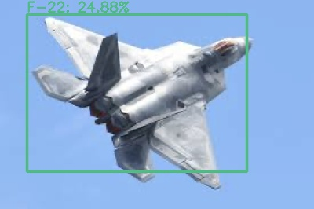

# Zero-Shot Object Detection with Pre-trained CLIP


## 1. Abstract

This repo needn't training, just use the pretrained model. Special thanks to mmdetection and CLIP repositories.

please install `mmdetection` from [mmdetection](https://github.com/open-mmlab/mmdetection) and `CLIP` from [CLIP](https://github.com/openai/CLIP).

I use:

```vim
pytorch 1.7.1
cuda 11.0
```

## 2. How to use

first, download the checkpoints of detector.

```shell
mkdir checkpoints
cd checkpoints
wget http://download.openmmlab.com/mmdetection/v2.0/faster_rcnn/faster_rcnn_r50_fpn_1x_coco/faster_rcnn_r50_fpn_1x_coco_20200130-047c8118.pth
```

Then, you may need change some parameters in `zsd.py`, include `description` and `classes`. Ensure:

```python
len(description) == len(classes)
```

`description` is a text, which can be a list of words or sequences. `classes` is the category of each `description`.

After defined, you can run:


```shell
python zsd.py
```

results:

|F-22|Su-57|
|--|--|
|||

# 3. Suggestions

You can add `nms`, which I haven't updated.
